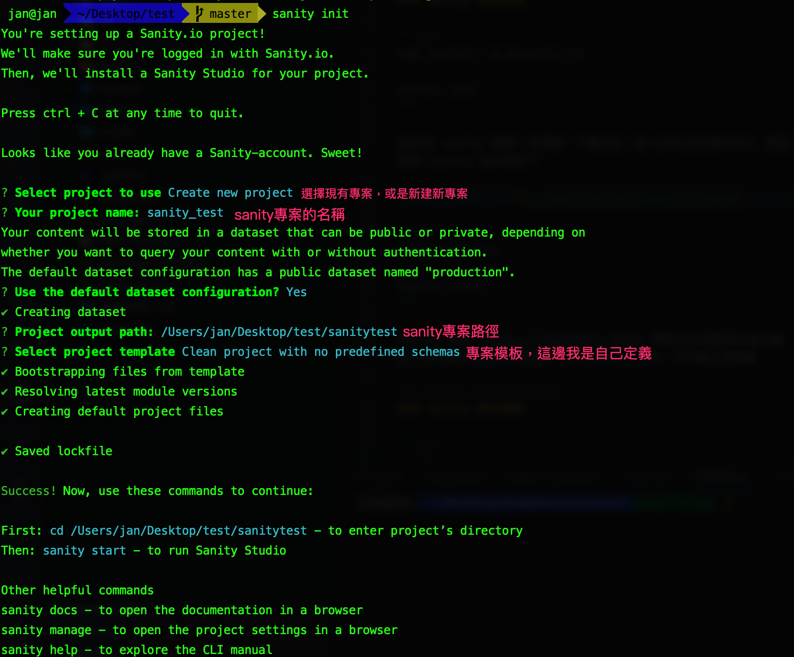
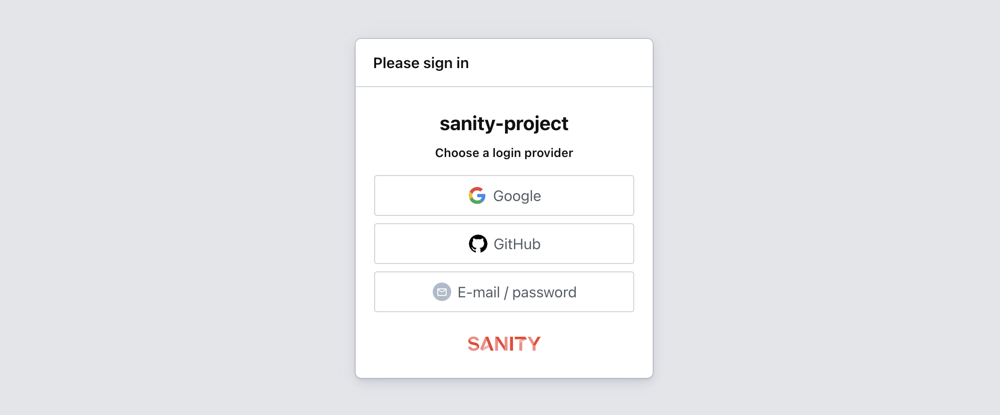
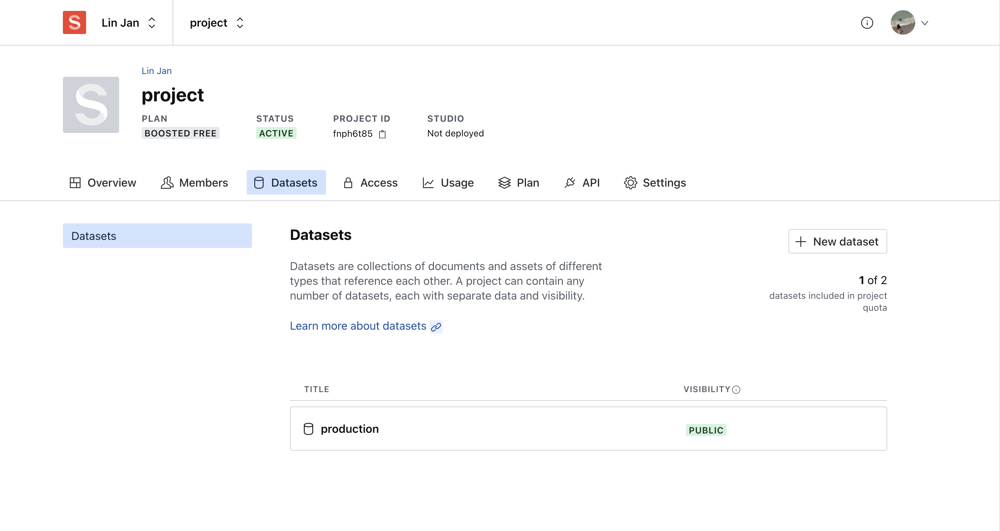
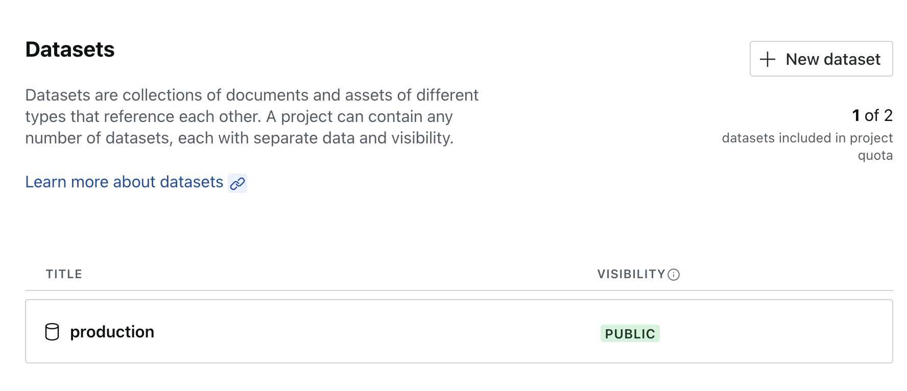
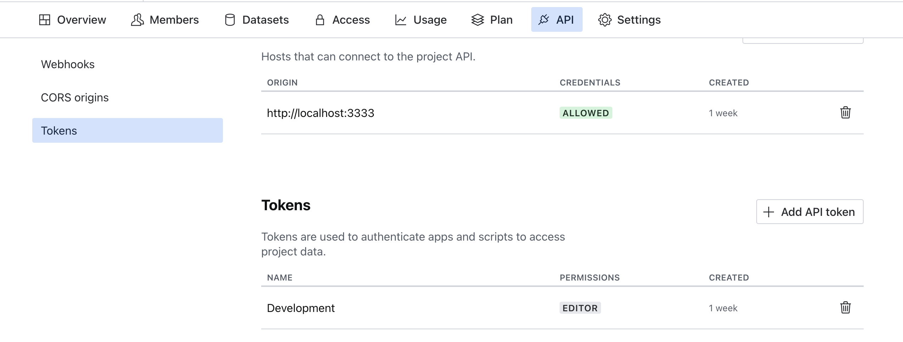
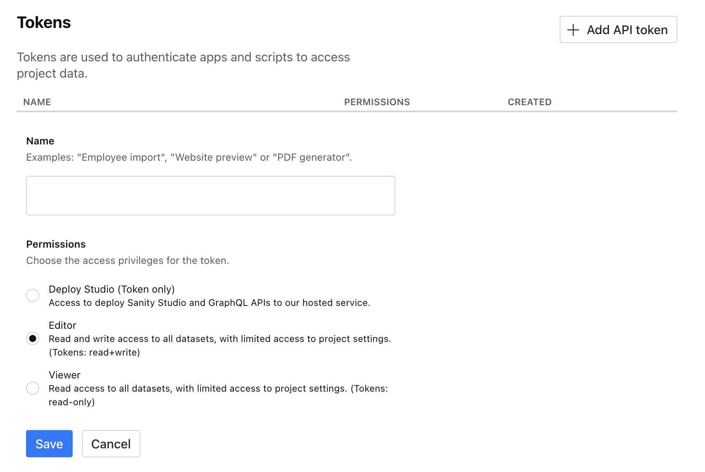
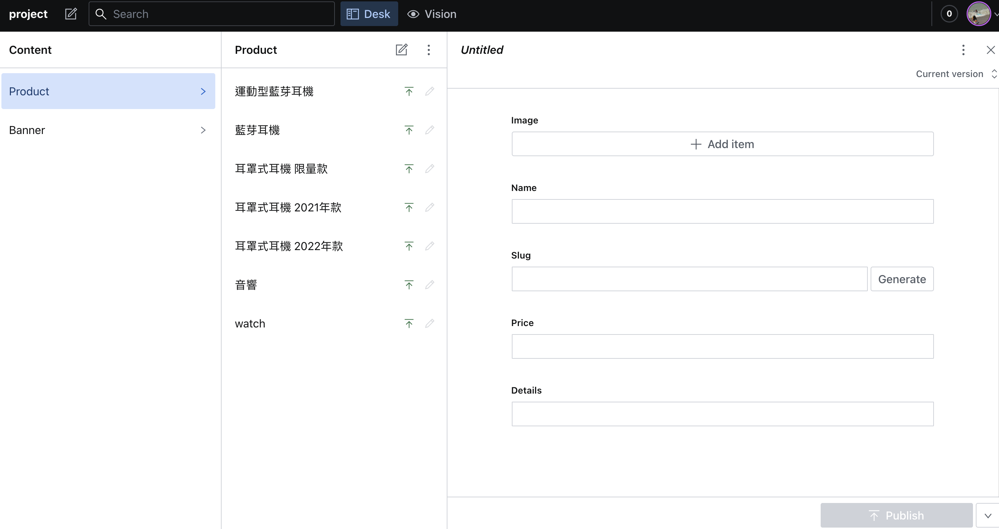
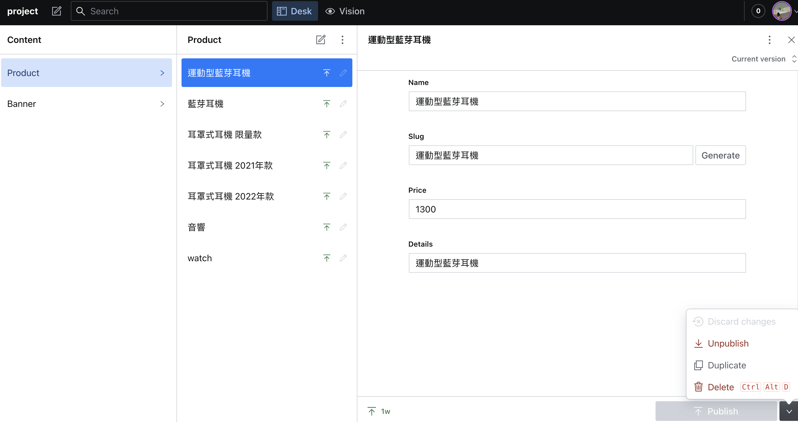

### 這邊會簡單介紹一下使用 sanity 的方法

## How to use Sanity

### Sanity 基礎設置

```js
npm install -g @sanity/cli

sanity init
```

這時候 sanity 會問一堆問題，下載完後，進入你命名的資料夾內，裡面就有 Sanity 基本資料了



```js
cd sanity-file

npm i @sanity/client

sanity start
```

Sanity 會在 https://localhost:3333/ 開啟你這個專案的後台畫面，記得建立專案時不要使用 localhost:3333，不然會出現問題

進入 localhost:3333 後，選擇自己喜歡的登入方式



由於我們前面選擇不要模板，所以內容會是空的，後面會帶大家新增內容

### Sanity 綁定專案

```js
sanity manage
```

開啟 sanity 管理工具，必且建立一個 sanity 帳號

建立一個 Datasets



在專案裡面建立一個 client.js 檔案，方便做 sanity 引入

```js
npm install @sanity/client

import sanityClient from "@sanity/client"
export default sanityClient({
    projectId: PROJECT_ID,
    dataset: DATASET_NAME,
    useCdn: true,
    token: TOKEN,
});
```

這邊的係數位置，我會以圖片方式呈現

projectId:


dataset: 就是前面建立好的 dataset，把取好的名稱輸入即可


token:
Token 必須先到 API/Tokens 裡面去建立一個 Token



Token 建立選擇我個人是選 Editor



當你走到這步時，基本上你的專案應該已經綁定 sanity 的資料庫了，如果發現他一直找不到對應的資料庫的話

**_請確認你的 sanity start(專案後台) 跟 sanity manage(帳號後台) 所開啟的平台是使用同一個方式開啟_**

> 簡單來說就是：如果是用 Google 登入的話，兩個後台都需要使用 Google 登入，反之 Github 登入也一樣

筆者因為這個問題在這裡卡了兩天...

## 建立專案 Sanity 後台

首先，先進入 sanity 為我們打包好的專案裡面

```js
cd your-file-name
```

這邊你會看到有一個資料夾叫做 schemas

[Sanity 官網](https://www.sanity.io/docs/content-modelling)

這邊我們會透過 schemas，建立一個後台新增系統

```js
export default {
  name: 'banner',
  title: 'Banner',
  type: 'document',
  fields: [
    {
      name: 'image',
      title: 'Image',
      type: 'image',
      options: {
        hotspot: true, // 選擇圖片area
      },
    },
    {
      name: 'buttonText',
      title: 'ButtonText',
      type: 'string',
    },
  ],
};
```

建立好專案後台後，就可以在 Terminal 輸入

```js
sanity start
```

來新增專想加入的內容了

[Image-Schemas](https://www.sanity.io/docs/image-type)

## 使用 Sanity

使用 api 不外乎就是要有 CRUD 功能，那 Sanity 一樣可以達到一樣效果

### C: Create

Sanity 的 Create 功能，是可以直接對後台做更改，不需要打 api



### R: Read

這個比較複雜我們拉出來講

[READ](#READ)

### U: Update

不確定有沒有這個功能，先跳過

### D: Delete

跟 Create 一樣，可以直接在後台執行(圖片右下角)


## READ

Sanity 找資料比較特殊一點，是使用 Query Language(GROQ)

[Sanity 官網](https://www.sanity.io/docs/groq)

```js
*[_type == "product"]
*[_type == "product" && slug.current == '${slug}'][0]
```

以上兩個行程式碼是不是看得似懂非懂?

沒關係打開 Sanity 官網有很好的解釋

```js
{
    _createdAt: '2022-06-08T03:34:06Z',
    _id: 'a0e6b60c-f297-4911-81da-46ccaad8f4b4',
    _rev: 'sGrqvfP2mxJ5kXjUrZke6B',
    _type: 'product',
    _updatedAt: '2022-06-08T03:34:06Z',
    details: '耳罩式耳機 2021年款',
    image: [ [Object], [Object], [Object], [Object] ],
    name: '耳罩式耳機 2021年款',
    price: 1300,
    slug: { _type: 'slug', current: '耳罩式耳機 2021年款' }
  },
```

上圖會是你建立 Sanity 內容後打包出來的樣子(基本上不會只有一筆，我這邊是簡略)

今天如果想從這筆資料裡面取出 type 為 product 的資料，怎麼取？很簡單

```js
// is of _type "product"
*[_type == "auproducthor"]
```

既然第一條程式碼我們已經瞭解了，那第二條程式碼也應該可以聊解

```js
*[_type == "product" && slug.current == '${slug}'][0]
```

了解到 Sanity 如何取資料後，我們實戰演練一下

如果我今天想分別取 type 為 product 跟 type 為 banner 的資料，以下就是正確的取資料方法

```js
const query = '*[_type == "product"]';
const products = await client.fetch(query);

const bannerQuery = '*[_type == "banner"]';
const bannerData = await client.fetch(bannerQuery);
```

以上就是 sanity 基本使用，從基本專案建立到取出資料，我們下次見，掰掰
